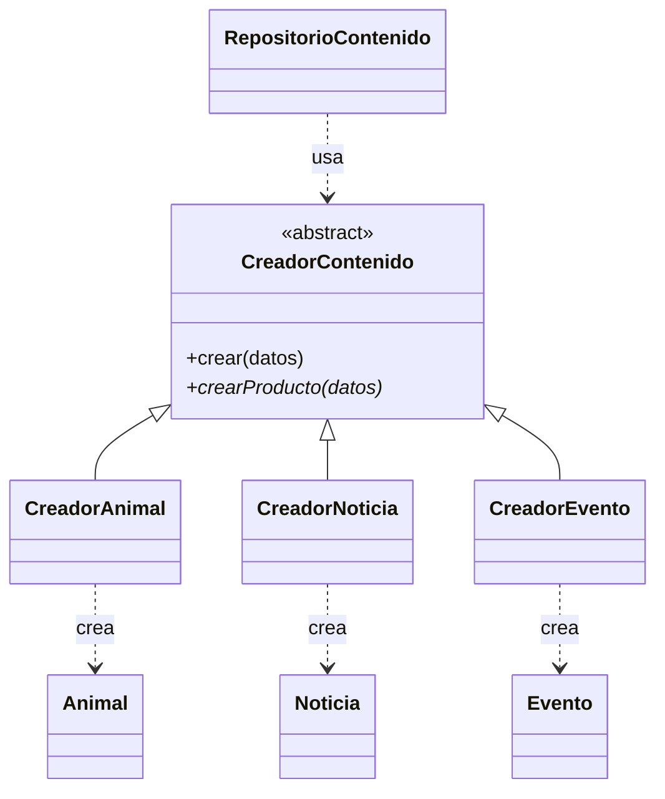
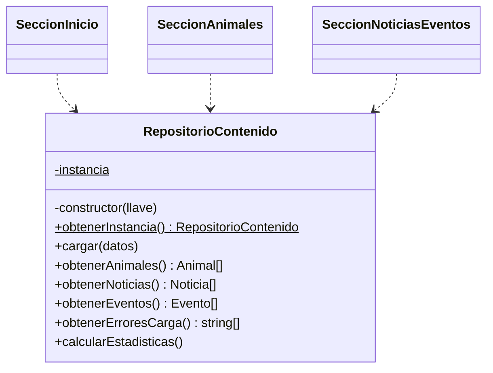
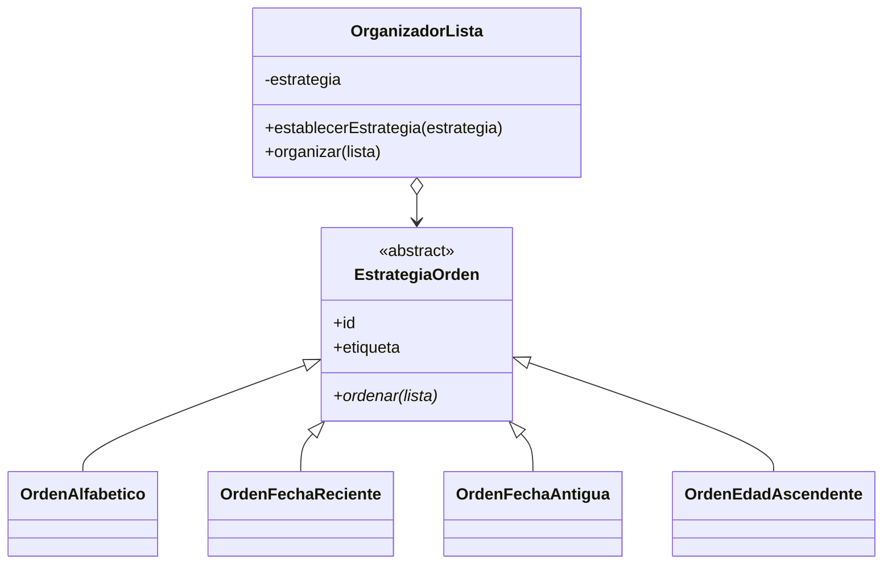
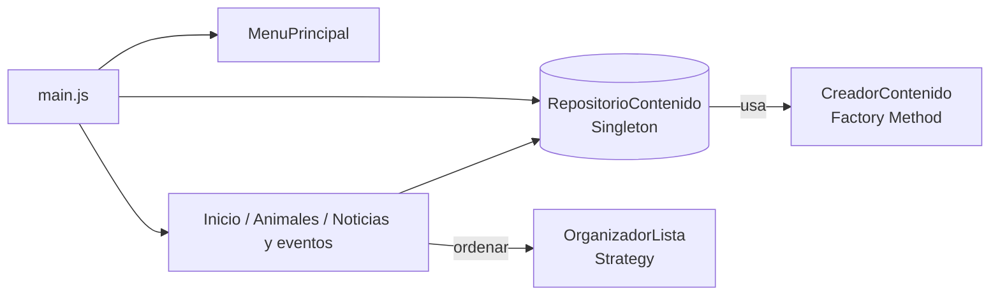

# Diagramas de los patrones implementados

Los diagramas se renderizan automáticamente en GitHub.

## Factory Method

```mermaid
classDiagram
    class CreadorContenido {
        <<abstract>>
        +crear(datos)
        +crearProducto(datos)*
    }
    class CreadorAnimal
    class CreadorNoticia
    class CreadorEvento
    class Animal
    class Noticia
    class Evento
    CreadorContenido <|-- CreadorAnimal
    CreadorContenido <|-- CreadorNoticia
    CreadorContenido <|-- CreadorEvento
    CreadorAnimal ..> Animal : crea
    CreadorNoticia ..> Noticia : crea
    CreadorEvento ..> Evento : crea
    class RepositorioContenido
    RepositorioContenido ..> CreadorContenido : usa
```

## Singleton

```mermaid
classDiagram
    class RepositorioContenido {
        -instancia$
        -constructor(llave)
        +obtenerInstancia()$ RepositorioContenido
        +cargar(datos)
        +obtenerAnimales() Animal[]
        +obtenerNoticias() Noticia[]
        +obtenerEventos() Evento[]
        +obtenerErroresCarga() string[]
        +calcularEstadisticas()
    }
    SeccionInicio ..> RepositorioContenido
    SeccionAnimales ..> RepositorioContenido
    SeccionNoticiasEventos ..> RepositorioContenido
```

## Strategy

```mermaid
classDiagram
    class EstrategiaOrden {
        <<abstract>>
        +id
        +etiqueta
        +ordenar(lista)*
    }
    class OrdenAlfabetico
    class OrdenFechaReciente
    class OrdenFechaAntigua
    class OrdenEdadAscendente
    class OrganizadorLista {
        -estrategia
        +establecerEstrategia(estrategia)
        +organizar(lista)
    }
    EstrategiaOrden <|-- OrdenAlfabetico
    EstrategiaOrden <|-- OrdenFechaReciente
    EstrategiaOrden <|-- OrdenFechaAntigua
    EstrategiaOrden <|-- OrdenEdadAscendente
    OrganizadorLista o--> EstrategiaOrden
```

## Flujo de la página principal

```mermaid
flowchart LR
    main[main.js] --> repo[(RepositorioContenido<br/>Singleton)]
    repo -->|usa| fabrica[CreadorContenido<br/>Factory Method]
    main --> menu[MenuPrincipal]
    main --> vistas[Inicio / Animales / Noticias y eventos]
    vistas --> repo
    vistas -->|ordenar| estrategia[OrganizadorLista<br/>Strategy]
```
